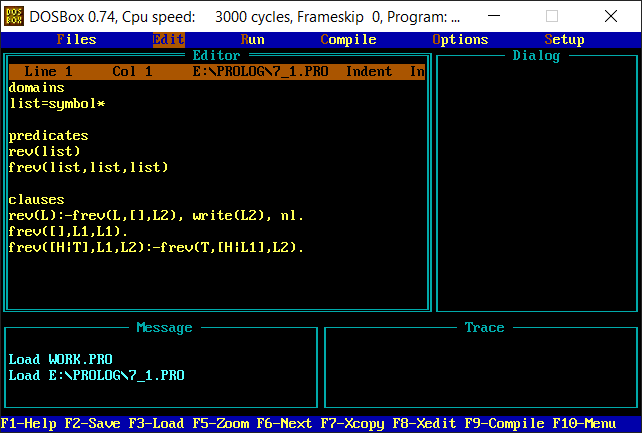

# Prolog Programs
This repository contains prolog codes that were written during coursework.
  

<table>
  <tr>
    <th>Program</th>
    <th>Purpose</th>
  </tr>
  <tr>
    <td>begin.pro</td>
    <td>append a letter to beginning of a list</td>
  </tr>
  <tr>
    <td>end.pro</td>
    <td>append an element to end of a list</td>
  </tr>
  <tr>
    <td>member.pro</td>
    <td>check if an element is present in a list</td>
  </tr>
  <tr>
    <td>position.pro</td>
    <td>find the position of an element from beginning or end in a list</td>
  </tr>
  <tr>
    <td>reverse.pro</td>
    <td>reverse a list</td>
  </tr>
</table>
